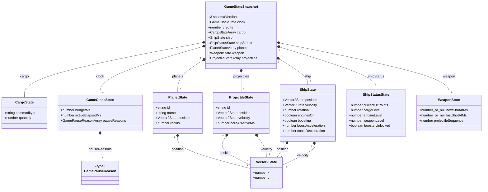

<!-- generated by arch-make-data-logical-diag -->

# Logical Game State Diagram

Authoritative, persistable state reachable from `GameStateSnapshot`.

## Classifications

| Classification | Representation |
| --- | --- |
| Persisted | Entities in this diagram and the versioned snapshot codec |
| Derived | Excluded; recomputed by pure selectors or reducers |
| Transient | Excluded; input, Phaser objects, effects, and audio adapters |
| Configuration | Excluded; static definitions and tuning |

## Diagram

## Entity inventory

| Entity | Classification | Source |
| --- | --- | --- |
| CargoState | Persisted | [cargoState.ts](../../src/game/state/cargoState.ts#L1) |
| GameClockState | Persisted | [gameClockState.ts](../../src/game/state/gameClockState.ts#L3) |
| GamePauseReason | Persisted | [gameClockState.ts](../../src/game/state/gameClockState.ts#L1) |
| GameStateSnapshot | Persisted | [gameStateSnapshot.ts](../../src/game/state/gameStateSnapshot.ts#L9) |
| PlanetState | Persisted | [planetState.ts](../../src/game/state/planetState.ts#L3) |
| ProjectileState | Persisted | [projectileState.ts](../../src/game/state/projectileState.ts#L3) |
| ShipState | Persisted | [shipState.ts](../../src/game/state/shipState.ts#L3) |
| ShipStatusState | Persisted | [shipStatusState.ts](../../src/game/state/shipStatusState.ts#L1) |
| Vector2State | Persisted | [vector2State.ts](../../src/game/state/vector2State.ts#L1) |
| WeaponState | Persisted | [weaponState.ts](../../src/game/state/weaponState.ts#L1) |

## Field inventory

| Entity | Field | Type | Cardinality |
| --- | --- | --- | --- |
| CargoState | commodityId | `string` | 1 |
| CargoState | quantity | `number` | 1 |
| GameClockState | budgetMs | `number` | 1 |
| GameClockState | activeElapsedMs | `number` | 1 |
| GameClockState | pauseReasons | `readonly GamePauseReason[]` | 0..* |
| GamePauseReason | value | `'background' \| 'landed' \| 'manual'` | 1 |
| GameStateSnapshot | schemaVersion | `3` | 1 |
| GameStateSnapshot | clock | `GameClockState` | 1 |
| GameStateSnapshot | credits | `number` | 1 |
| GameStateSnapshot | cargo | `readonly CargoState[]` | 0..* |
| GameStateSnapshot | ship | `ShipState` | 1 |
| GameStateSnapshot | shipStatus | `ShipStatusState` | 1 |
| GameStateSnapshot | planets | `readonly PlanetState[]` | 0..* |
| GameStateSnapshot | weapon | `WeaponState` | 1 |
| GameStateSnapshot | projectiles | `readonly ProjectileState[]` | 0..* |
| PlanetState | id | `string` | 1 |
| PlanetState | name | `string` | 1 |
| PlanetState | position | `Vector2State` | 1 |
| PlanetState | radius | `number` | 1 |
| ProjectileState | id | `string` | 1 |
| ProjectileState | position | `Vector2State` | 1 |
| ProjectileState | velocity | `Vector2State` | 1 |
| ProjectileState | bornAtActiveMs | `number` | 1 |
| ShipState | position | `Vector2State` | 1 |
| ShipState | velocity | `Vector2State` | 1 |
| ShipState | rotation | `number` | 1 |
| ShipState | enginesOn | `boolean` | 1 |
| ShipState | boosting | `boolean` | 1 |
| ShipState | boostAcceleration | `number` | 1 |
| ShipState | coastDeceleration | `number` | 1 |
| ShipStatusState | currentHitPoints | `number` | 1 |
| ShipStatusState | cargoLevel | `number` | 1 |
| ShipStatusState | engineLevel | `number` | 1 |
| ShipStatusState | weaponLevel | `number` | 1 |
| ShipStatusState | boosterUnlocked | `boolean` | 1 |
| Vector2State | x | `number` | 1 |
| Vector2State | y | `number` | 1 |
| WeaponState | nextShotAtMs | `number \| null` | 0..1 |
| WeaponState | lastShotAtMs | `number \| null` | 0..1 |
| WeaponState | projectileSequence | `number` | 1 |

## Boundary findings

No findings.
